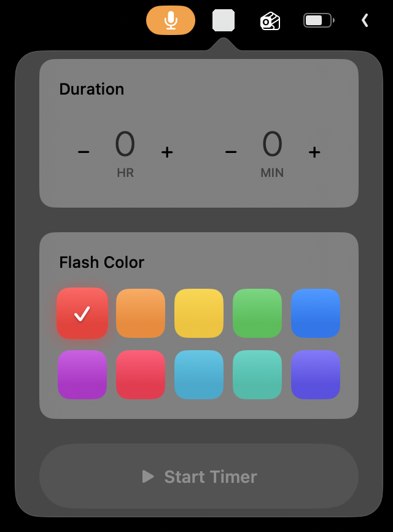
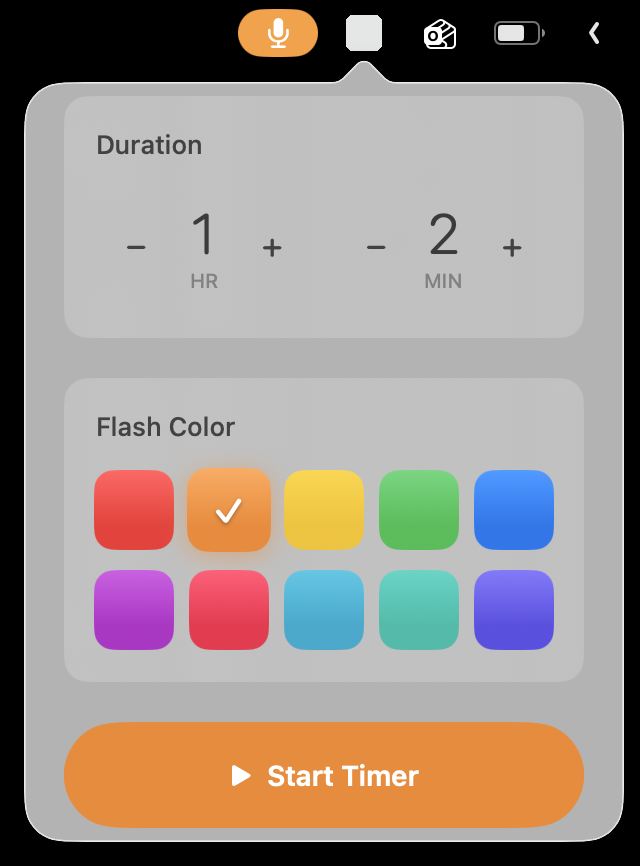
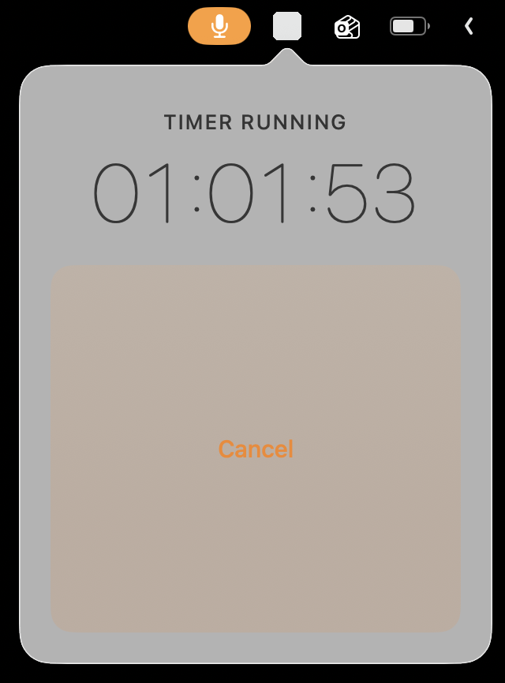

# Silent Alarm

A silent, visual-only timer that lives in your Mac's menu bar. No sounds — just a color flash when time's up.

  
  
  

## Features

- **No sound** — visual alerts only
- **Menu bar app** — stays out of your way
- **Color-coded** — pick from 10 flash colors
- **Flexible** — set by duration (hours + minutes) or specific time

## Install

1. Download from the Mac App Store

**Or build from source:**

1. Open `SilentAlarm.xcodeproj` in Xcode
2. Build and run (`Cmd+R`)

Requires macOS 13.0+

## License

MIT
